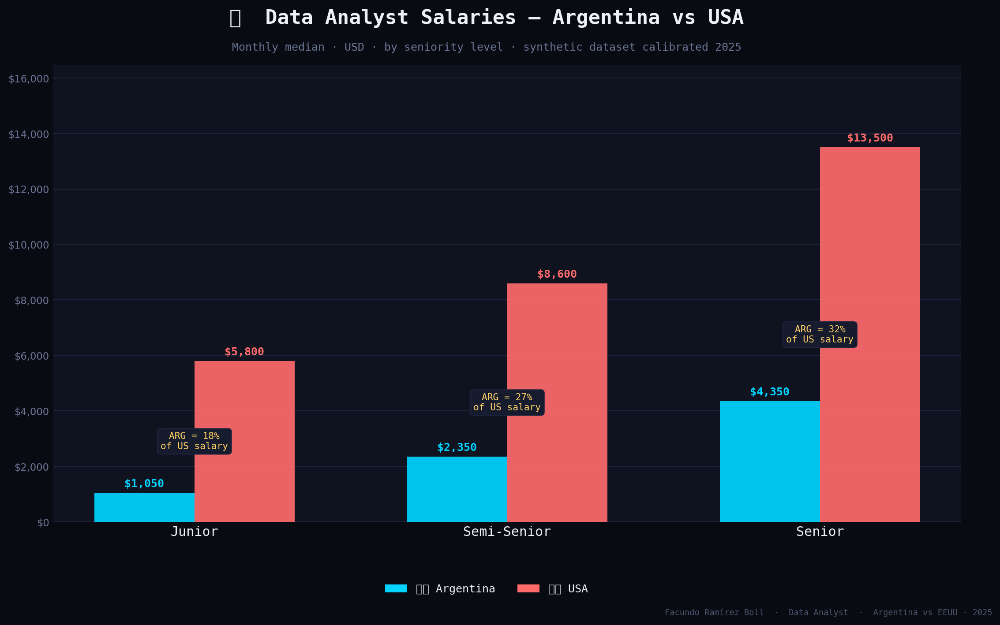
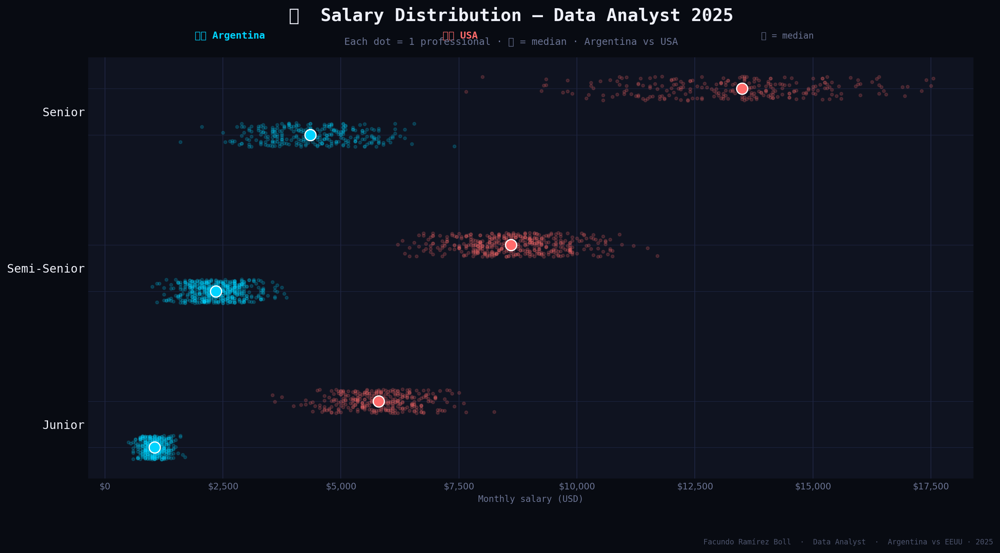
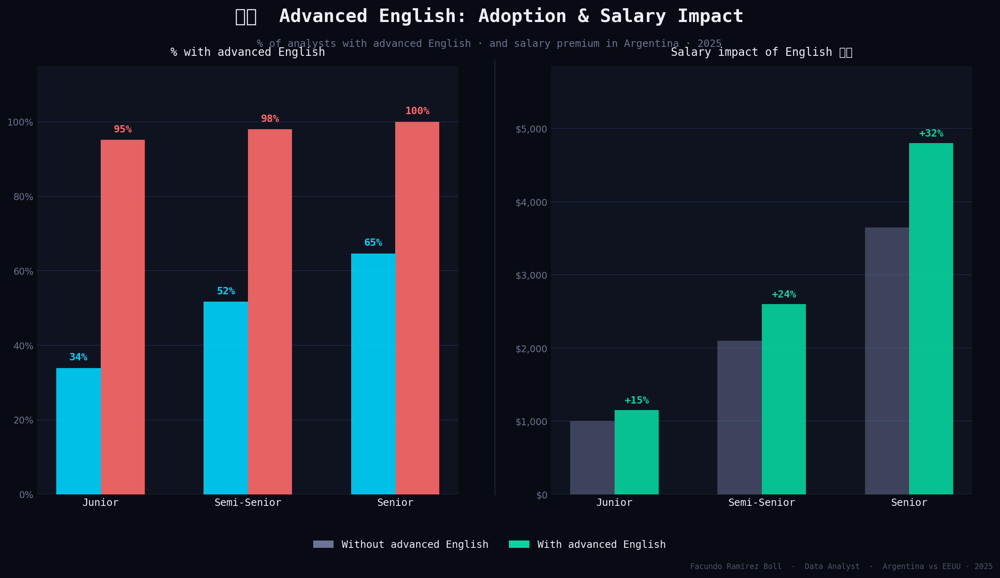
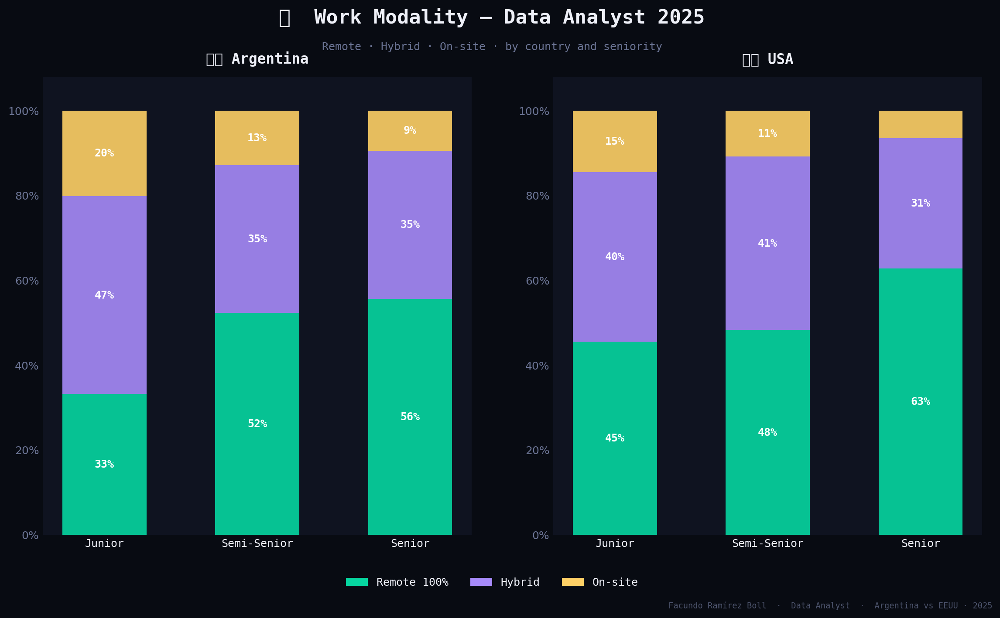
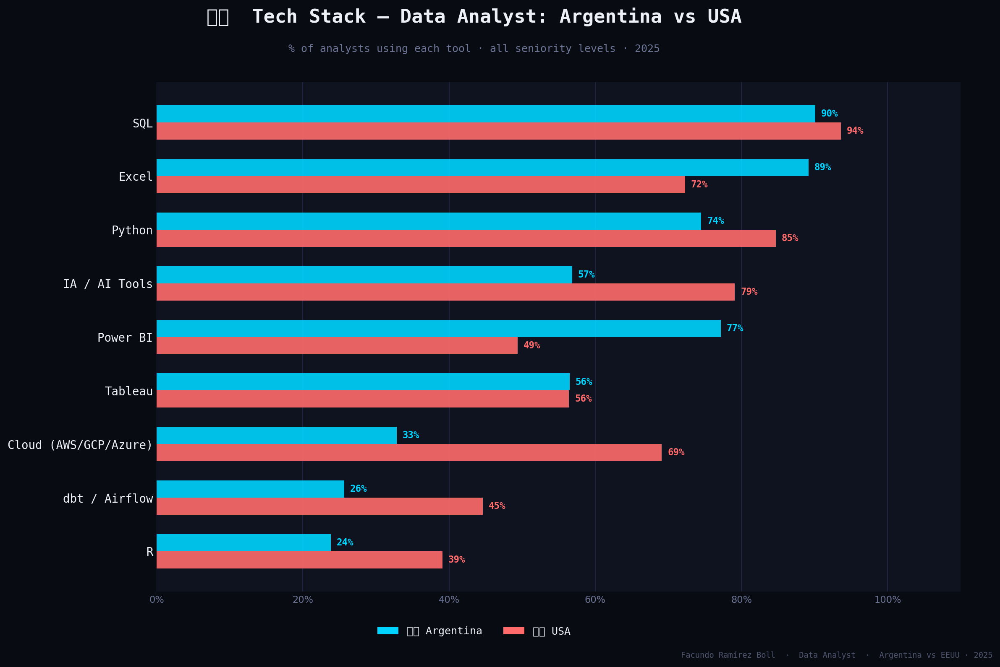
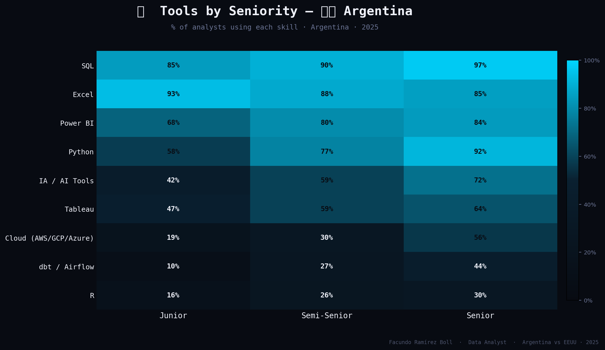
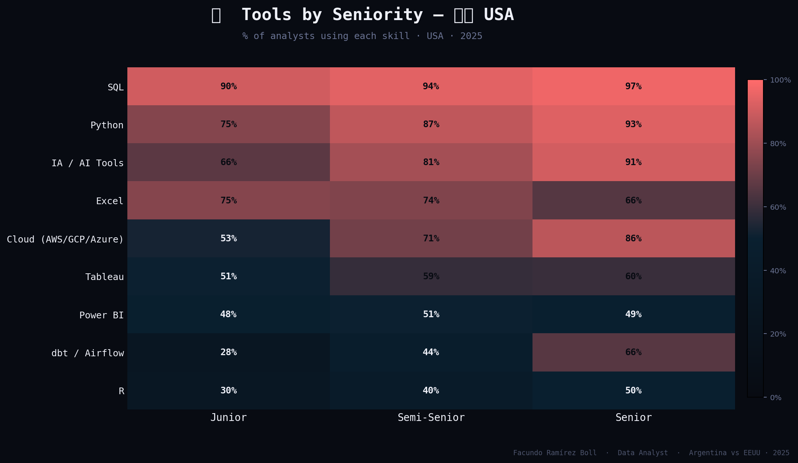
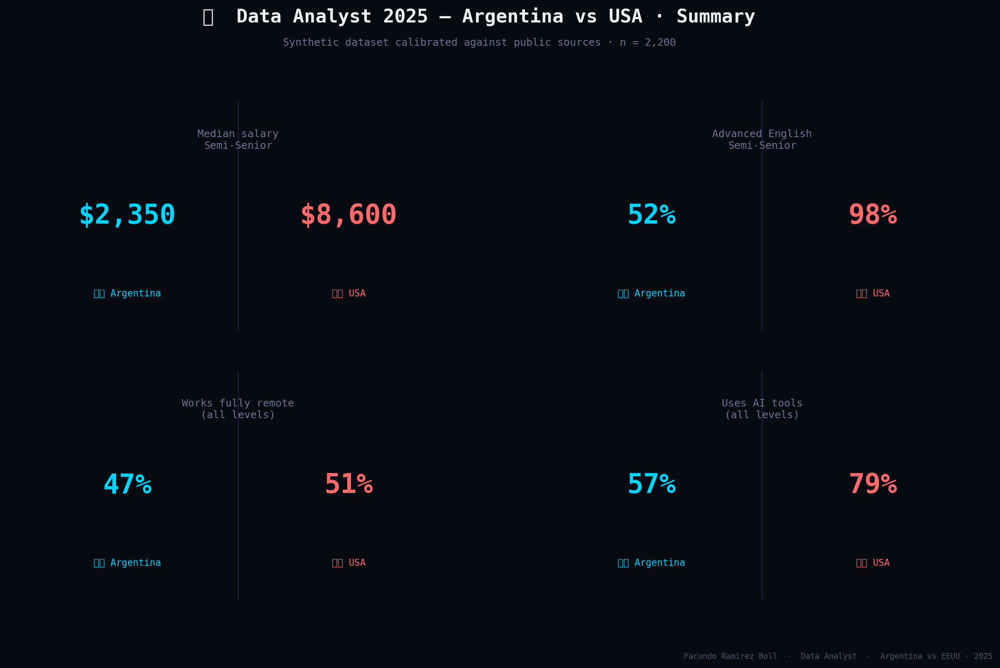

# 📊 Data Analyst Salaries — Argentina vs USA · 2025

**Portfolio project | Facundo Iván Ramírez Boll**  
`Python` · `Pandas` · `Matplotlib` · `Exploratory Data Analysis` · `Data Visualization`

---

## What this project is about

A focused comparison of **Data Analyst** compensation, tools, English proficiency and work modality between **Argentina** and the **United States** — the two markets most relevant to remote-first hiring in the region.

The analysis answers questions every Argentine data professional asks at some point:

- How large is the salary gap between Argentina and the US, by seniority?
- Does advanced English actually translate to higher pay in Argentina?
- Which tools dominate each market — and how different are the stacks?
- How widespread is remote work for data analysts in 2025?

---

## ⚠️ Data origin & methodology

> **This project uses a synthetic dataset of 2,200 records, calibrated against real public sources.**

| Source | Usage |
|---|---|
| [SysArmy Salary Survey 2024-2025](https://sueldos.openqube.io/) | Argentina salary ranges |
| [US Bureau of Labor Statistics 2025](https://www.bls.gov/) | US salary benchmarks |
| [Glassdoor — Data Analyst USA 2025](https://www.glassdoor.com/) | US salary distribution |
| [Stack Overflow Developer Survey 2024](https://survey.stackoverflow.co/2024/) | Tool adoption rates |
| [LinkedIn Jobs — Argentina & USA](https://www.linkedin.com/jobs/) | Skill frequency, work modality |

**Why synthetic data?**  
No single public dataset covers both countries with comparable structure and sample size. Generating a calibrated synthetic dataset — standard practice in academic and portfolio projects — allows full control over the analysis while maintaining alignment with real market ranges reported by the cited sources for 2025.

---

## Key findings

### 💰 Salary gap

An Argentine Data Analyst earns between **16% and 32%** of the US equivalent at the same seniority level.

| Seniority | 🇦🇷 Argentina | 🇺🇸 USA | ARG as % of US |
|---|---|---|---|
| Junior | ~$1,050/mo | ~$5,800/mo | 18% |
| Semi-Senior | ~$2,350/mo | ~$8,600/mo | 27% |
| Senior | ~$4,350/mo | ~$13,500/mo | 32% |

### 🗣️ Advanced English premium in Argentina

English proficiency adds between **20% and 30%** to an Argentine analyst's salary. Adoption is growing: 65% of Senior analysts now report advanced English, reflecting increased access to remote international roles.

### 🛠️ Tool stack differences

- **SQL and Python** are universal in both markets (85%+ adoption)
- **Power BI** dominates in Argentina; the US leans toward cloud-native tools
- **AI tools** adoption jumped in 2025: 72% of Senior analysts in Argentina now use AI in their workflow
- **Cloud (AWS/GCP/Azure)** adoption is significantly higher in the US at all seniority levels

### 🏠 Remote work

Over **50% of Argentine data analysts** work fully remote — rising to 62% at Senior level.

---

## Charts

### Salary by seniority level


### Salary distribution


### Advanced English: adoption & salary impact


### Work modality


### Tech stack comparison


### Tools by seniority — Argentina


### Tools by seniority — USA


### Summary dashboard


---

## Project structure

```
da-analyst-arg-usa-2025/
│
├── generate_dataset.py       ← Generates da_arg_eeuu_2025.csv
├── analysis.py               ← Produces all 8 charts
├── da_arg_eeuu_2025.csv      ← Synthetic dataset (2,200 records)
├── requirements.txt          ← Python dependencies
│
├── charts/
│   ├── chart1_salario_seniority.png
│   ├── chart2_distribucion.png
│   ├── chart3_ingles.png
│   ├── chart4_modalidad.png
│   ├── chart5_herramientas.png
│   ├── chart6_heatmap_arg.png
│   ├── chart7_heatmap_eeuu.png
│   └── chart8_kpis.png
│
└── README.md
```

---

## How to run it

```bash
# 1. Clone the repository
git clone https://github.com/facurboll/da-analyst-arg-usa-2025
cd da-analyst-arg-usa-2025

# 2. Install dependencies
pip install -r requirements.txt

# 3. Generate the dataset
python generate_dataset.py

# 4. Generate all charts
python analysis.py
```

---

## Techniques applied

- Synthetic data generation with calibrated statistical distributions (`numpy.random`)
- Exploratory analysis with `pandas`: groupby, pivot tables, conditional aggregations
- Advanced `matplotlib` visualizations: grouped bars, scatter plots, heatmaps, stacked bars, KPI dashboards
- Chart design for social media: dark mode palette, inline labels, consistent visual identity across 8 charts

---

## 🌎 Versión en español

Comparación entre **Argentina y Estados Unidos** en cuatro dimensiones clave para los analistas de datos: salarios, herramientas, inglés avanzado y modalidad de trabajo.

**Hallazgos principales:**

- Un analista argentino gana entre el **16% y el 32%** del salario equivalente en EEUU según su seniority
- El inglés avanzado representa entre un **20% y un 30% de premium salarial** en Argentina
- **SQL y Python** son universales en ambos mercados (más del 85% de adopción)
- La adopción de **herramientas de IA** creció fuertemente: 72% de los Senior en Argentina las usan en 2025
- Más del **50% de los analistas argentinos** trabaja 100% remoto

Dataset sintético de 2.200 registros calibrado con fuentes públicas: SysArmy 2025, BLS, Glassdoor, Stack Overflow Developer Survey 2024 y LinkedIn Jobs.

---

## About the author

**Facundo Iván Ramírez Boll**  
Contador Público (CPA) | Data Analyst  
SQL · Python · Power BI · Tableau · Advanced Excel  
Advanced written English · Intermediate spoken English

- 📧 facuboll@gmail.com
- 💼 [LinkedIn](https://www.linkedin.com/in/facundo-ramirez-boll)
- 📁 [Portfolio](#)
- 📊 [Tableau Public](#)

---

*This project is part of my professional data analytics portfolio.*  
*Found an error or want to collaborate? Open an issue or reach out directly.*
